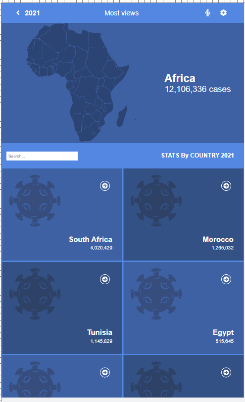
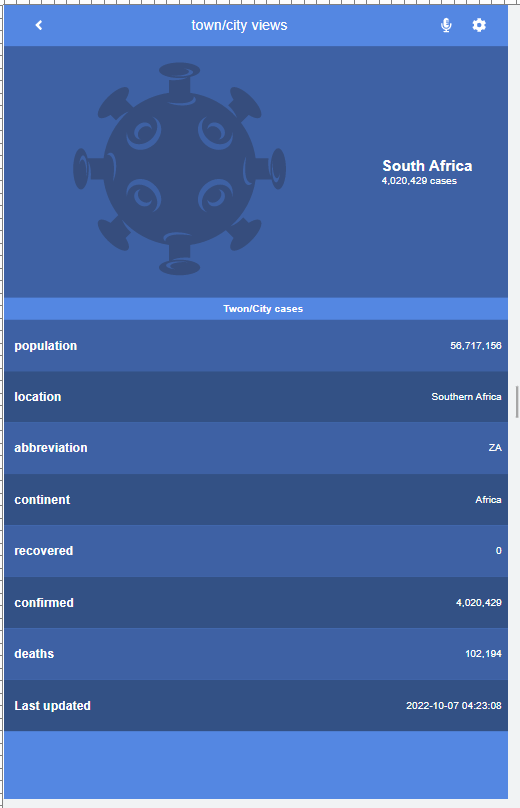

# Covid_19_data

## Description
- Covid 19 Data is a tracking site that provides the necessary information on covid 19 cases in any African country and their update
  

||     Home       ||        Details        ||
|-|----------------------|-| ----------------------|-|
||||||

## Learning objectives

- Use React documentation.
- Use React components.
- Use React props.
- Use React Router.
- Connect React and Redux.
- Handle events in a React app.
- Write integration tests with a React testing library.
- Use styles in a React app.
- Use React life cycle methods.
- Apply React best practices and language style guides in code.
- Use store, actions and reducers in React.


### Built With

Runs the app in the development mode.\
Open [http://localhost:3000](http://localhost:3000) to view it in the browser.
This project is build with:

The page will reload if you make edits.\
You will also see any lint errors in the console.
-  
-   

## Live Demo Link

### [Live Demo](https://christabelle143-78cc21.netlify.app/)

## Loom Video Link

### [Loom](https://www.loom.com/share/e826ba201e4146508c393a459515834c)


## Getting Started

### Clone this repository

- To get the content of this project locally you need to run this command in your terminal:

```bash
$ git clone git@github.com:Christabelle143/covid-19-app.git
$ cd covid-19-data
```
### Run project

- After cloning the project you need to run this command

```bash
$ npm run start 
```


The build is minified and the filenames include the hashes.\
Your app is ready to be deployed!

## Setup 

### Install React Font Awesome

- Get Started:
  
```bash
$  npm i --save @fortawesome/fontawesome-svg-core
```
  
```bash
$   npm install --save @fortawesome/free-solid-svg-icons
```
  
```bash
$  npm install --save @fortawesome/react-fontawesome
```

To watch and output to directories by using folder paths as your input and output

### Install React Router

- To use the Router component provided to wrap your components and associate them with a path.

```bash
$ npm install react-router-dom 
```
### Install React Redux Loading Bar


```bash
$ npm install --save react-redux-loading-bar
```
## Tests

- Install
  
```bash
$  npm i @testing-library/jest-dom   
```
```bash
$ npm install --save-dev @testing-library/jest-dom
```

- Run test
  
```bash
$ npm run test
```
## Author

👤 **Youta Christabelle**

- GitHub: [@Christabelle143](https://github.com/Christabelle143)
- Twitter [@christabelleyo](https://twitter.com/christabelleyo)
- LinkedIn [youtachristabelle](https://www.linkedin.com/in/youta-christabelle/)

## :handshake: Contributing

Feel free to check the [issues page](https://github.com/Christabelle143/covid-19-app/issues)

Give a :star: if you like this project! ❤️❤️❤️

## Acknowledgments

- Thanks to everyone who will get time to check this code especially to code reviewers.

## 📝 License

This project is [MIT](https://github.com/Christabelle143/covid-19-app/blob/dev/MIT.md) licensed.
